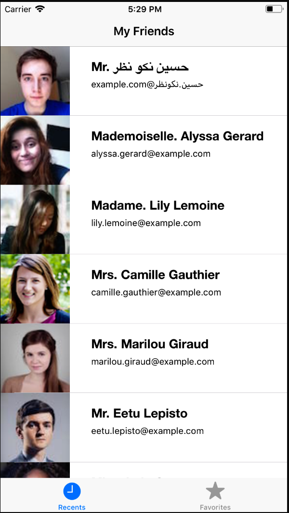
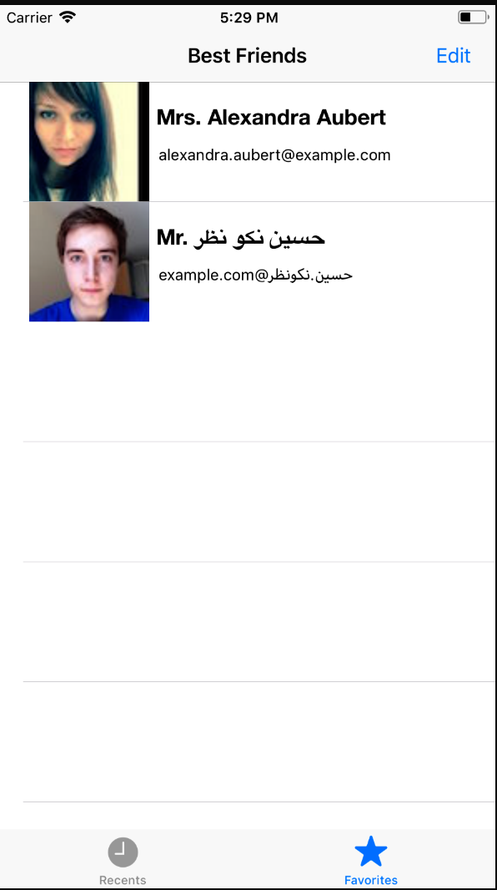
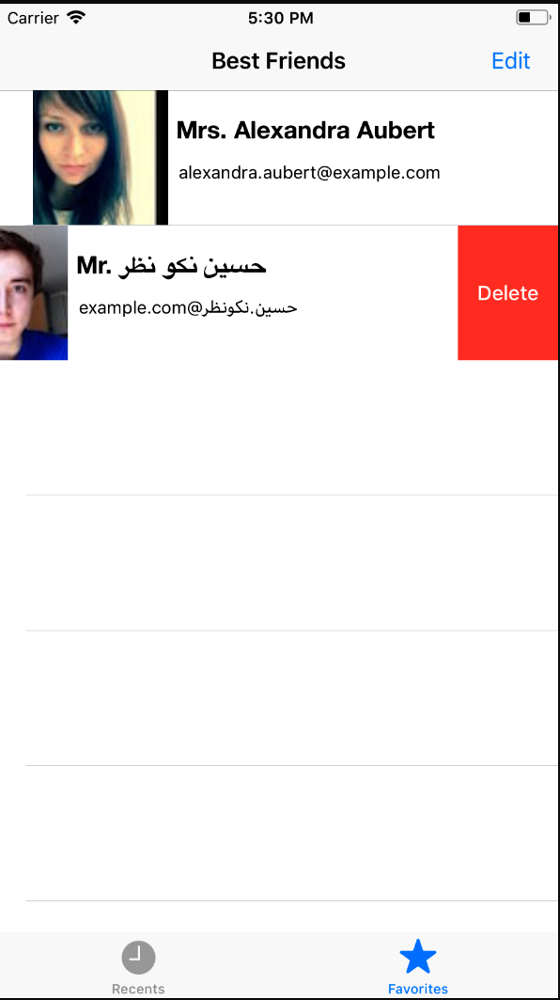
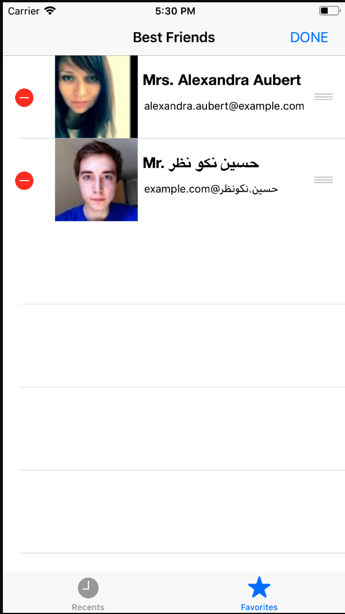

# MyBestFriend - iOS 

해당 프로젝트는 swift로 제작되었습니다. 


## Features

* https://randomuser.me/api를 통해 제공받은 유저 데이터를 기반으로 테이블에 보여줍니다.
* NSURLSession을 사용하여 json 파싱을 진행합니다.
* FileManager을 통해 로컬 메모리에 best friend 목록을 추가, 수정합니다.

## Syntax Highlight

```swift
 /*
     NSURL 형식으로 url 변수를 저장하고 api 메서드 호출
     Json 데이터를 URLSession.shared.dataTask로 NSDictionary 형태로 저장
     DispatchQueue를 통해 비동기적으로 받은 데이터를 UI 테이블 뷰에 추가함
     */
    
    func downloadWithURL(){
        let url = NSURL(string: "https://randomuser.me/api/?results=20&inc=name,picture,nat,cell,email,id")
        
        self.itemList.removeAll()
        
        var downloadTask = URLRequest(url: (url as URL?)!, cachePolicy: URLRequest.CachePolicy.reloadIgnoringCacheData,
                                      timeoutInterval: 20)
        
        downloadTask.httpMethod = "GET"
        URLSession.shared.dataTask(with: downloadTask, completionHandler: {(data, response, error) -> Void in
            
            if let jsonObj = try? JSONSerialization.jsonObject(with: data!, options: .allowFragments) as? NSDictionary{
                let result = jsonObj!.value(forKey: "results")as? [AnyObject]
                
              ...
                    DispatchQueue.main.async { // Correct
                        self.tableView.reloadData()
                    }
                }
            }
            
        }).resume()
    }
```

```swift
// DocumentURL에 저장할 path를 todoURL로 저장
    static func UserDataURL() throws -> URL {
        let fileManager = FileManager.default
        let documentURL: URL
        let todosURL: URL
        
        documentURL = try fileManager.url(for: FileManager.SearchPathDirectory.documentDirectory,
                                          in: FileManager.SearchPathDomainMask.userDomainMask,
                                          appropriateFor: nil, create: false)
        todosURL = documentURL.appendingPathComponent("datas.plist")
        return todosURL
    }
```


## Screen Shot








